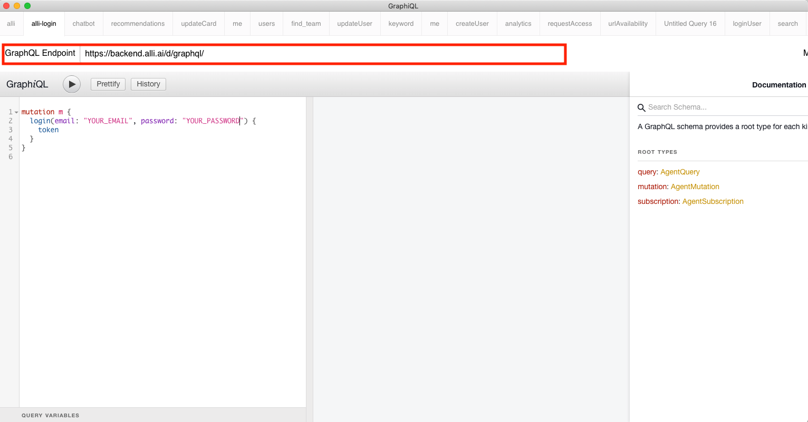
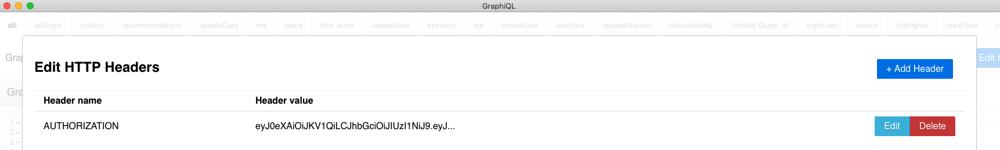
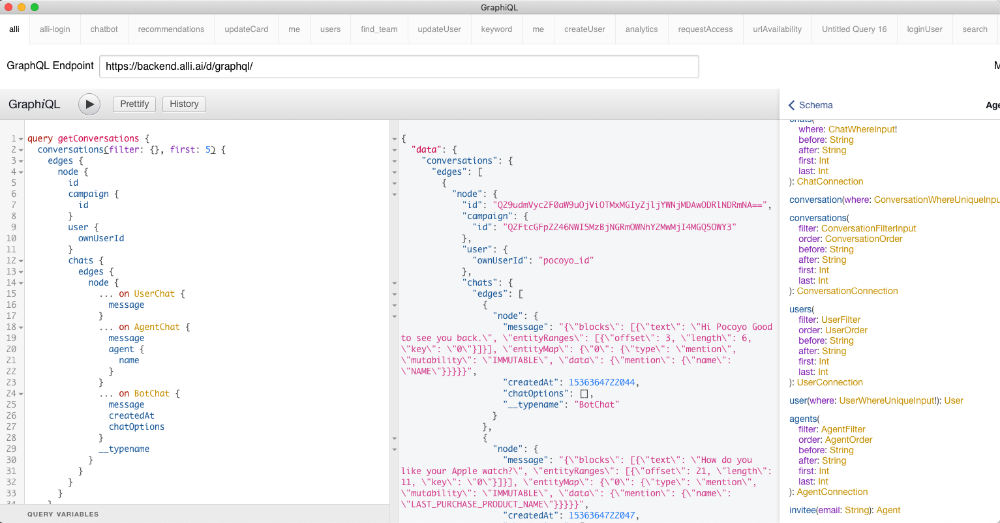
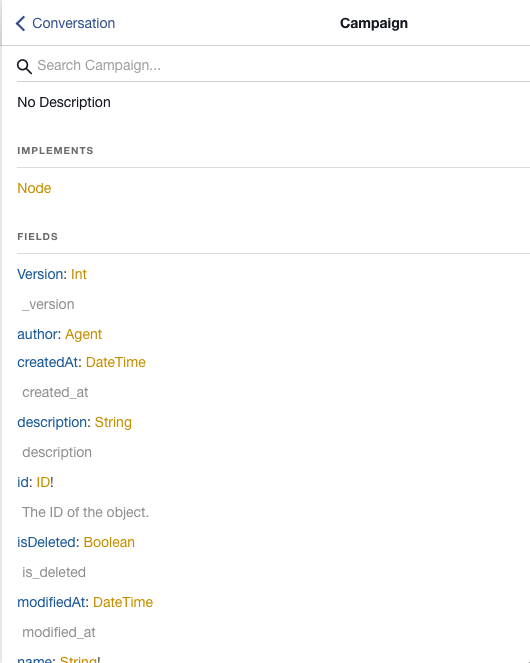
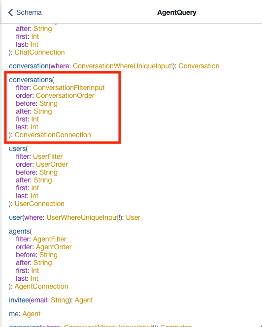
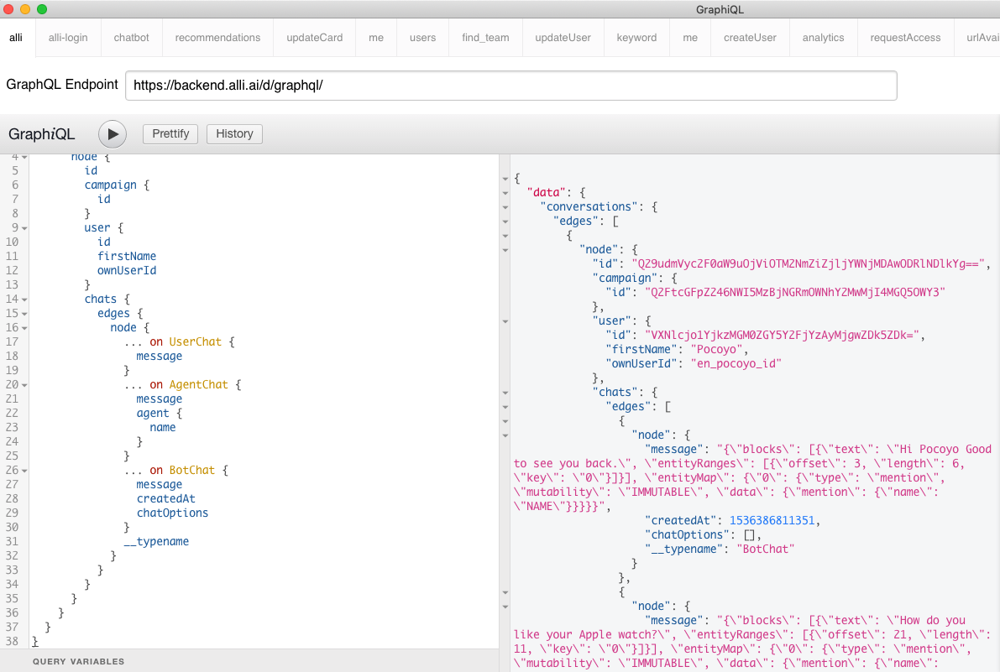
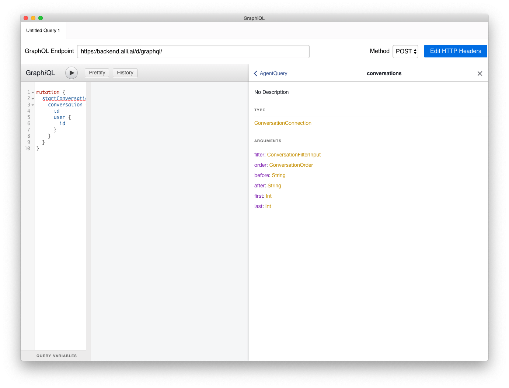

# Agent API


## Signup and setting campaign
-   You should see [Alli onboarding document](https://docs.google.com/document/d/1mfgtknMbnzDL6sKBKDOtWC0cnHwX59NT5nqWISqQZCE/edit#heading=h.ubhpu5uvlrg1).

## Tools & Library
GraphQL is implemented over standard HTTP and websocket. So you can choose any http, websocket library like python requests.

- A graphical interative in-brower GraphQL IDE : [https://github.com/graphql/graphiql  
](https://github.com/graphql/graphiql)
-   Python Library : [https://github.com/graphql-python/gql](https://github.com/graphql-python/gql)
-   Java Library : [https://github.com/apollographql/apollo-android](https://github.com/apollographql/apollo-android)
-   Node Library : [https://github.com/apollographql/apollo-client](https://github.com/apollographql/apollo-client)
-   Python websocket library : [https://pypi.org/project/websocket-client/](https://pypi.org/project/websocket-client/)

## Endpoints
- GRAPHQL_ENDPOINT: [https://backend.alli.ai/d/graphql/](https://backend.alli.ai/d/graphql/)

## Conversation list API Tutorial with GraphiQL

### Prerequisite
1.  Download :
Please download Graphiql from [here](https://github.com/graphql/graphiql)

1. Set the Endpoint to [https://backend.alli.ai/d/graphql/](https://backend.alli.ai/d/graphql/)



1. You need get a token to access to the conversation list. You can get the token through the login mutation.
```
mutation m {
  login(email: "YOUR_EMAIL", password: "YOUR_PASSWORD") {
    token
  }
}
```
1. Please put the token in HTTP header after clicking "Edit HTTP Headers" button. Header name is AUTHORIZATION and put the token in header value.



### Getting the conversations list
1. Retrieve conversations list by the following query.



```
query getConversations {
  conversations(filter: {}, first: 5) {
    edges {
      node {
        id
        campaign {
          id
        }
        user {
          ownUserId
        }
        chats {
          edges {
            node {
              ... on UserChat {
                message
              }
              ... on AgentChat {
                message
                agent {
                  name
                }
              }
              ... on BotChat {
                message
                createdAt
                chatOptions
              }
              __typename
            }
          }
        }
      }
    }
  }
}
```

1. If you want to get more fields you can simply add field name in the query.
Re: all the available field names and types, you can check it in the schema section.



For example, if you want to get more fields, such as name and description of the campaign in each conversation, you can simply put them in the query.

```
query getConversations {
  conversations(filter: {}, first: 5) {
    edges {
      node {
        id
        campaign {
          id
          name
          description
        }
        user {
          ownUserId
        }
        chats {
          edges {
            node {
              ... on UserChat {
                message
              }
              ... on AgentChat {
                message
                agent {
                  name
                }
              }
              ... on BotChat {
                message
                createdAt
                chatOptions
              }
              __typename
            }
          }
        }
      }
    }
  }
}
```

1. Retrieving conversations query takes the following parameters.
To see the detailed type specification of each parameters, please take a look at the schema documentation in GraphiQL.



 - filter
    - filter takes the following 6 parameters
        - campaignIds: list of campaign ids
        - userIds: list of user ids
        - state: one of the following ENUMs
            - INIT
            - END_OF_CHATBOT
            - END_BY_AGENT
            - END_BY_USER
            - WAIT_AGENT
            - WAIT_USER_ANSWER
            - WAIT_USER_ANSWER_2
            - INTERRUPTED
        - startAt_Gte: greater than the start date
        - endAt_Gte: lower than the end date
        - searchTerm: user's first name or last name
 - order: one of the following self explanatory ENUMs
    - CREATED_AT_ASC
    - CREATED_AT_DESC
    - MODIFIED_AT_ASC
    - MODIFIED_AT_DESC
    - LAST_CHAT_TIME_ASC
    - LAST_CHAT_TIME_DESC
    - CAMPAIGN_NAME_ASC
    - CAMPAIGN_NAME_DESC
 - before: ID for pagination. The result will only contain items before the id.
 - after: ID for pagination. The result will only contain items after the id.
 - first: int. The number of items from the beginning of the result.
 - last: int. The number of items from the end of the result.

### Query with the parameters.

- Retrieving the conversations list for the specific campaign.
You can get the campaign id from the url.
https://www.alli.ai/campaigns/CAMPAIGN_ID

For example, if you want to get the 3 conversations with the following conditions:
- the campaign id is Q2FtcGFpZ246NWI5MzBjNGRmOWNhY2MwMjI4MGQ5OWY3
- the user's name is Pocoyo

The query would look like

```
query getConversations {
  conversations(filter: {searchTerm: "Pocoyo", campaignIds: ["Q2FtcGFpZ246NWI5MzBjNGRmOWNhY2MwMjI4MGQ5OWY3"]}, first: 3) {
    edges {
      node {
        id
        campaign {
          id
        }
        user {
          id
          firstName
          ownUserId
        }
        chats {
          edges {
            node {
              ... on UserChat {
                message
              }
              ... on AgentChat {
                message
                agent {
                  name
                }
              }
              ... on BotChat {
                message
                createdAt
                chatOptions
              }
              __typename
            }
          }
        }
      }
    }
  }
}

```



## Agent API with Python Example
You can get api lists and arguments, fields using graphiql tool. Please see graphiql's Document section.


### Full example
- Please see example https://github.com/allganize/documents/blob/master/alli_api/agent_api_example.py

### Login
You can get authorization token using signin mutation.
And you can use agent permission apis using this token by sending AUTHORIZATION http header.

**Example**

```
gql = """
mutation signin($email:String!, $passwd:String!) {
  login(email:$email, password:$passwd) {
    token
  }
}
"""
variables = {
  "email": "",
  "passwd": ""
}

token = execute_gql(GRAPHQL_ENDPOINT, gql, variables=variables)['login']['token']
auth_headers = {
  'AUTHORIZATION': token
}
```

### Get Campaigns
You can get campaign lists using campaigns query.

**Get Campaigns Example**

Please see graphql relay spec. https://facebook.github.io/relay/graphql/connections.htm

```
gql = """
query getCampaigns($filter:CampaignFilter) {
  campaigns(filter:$filter) {
    edges {
      node {
        id
        name
      }
    }
  }
}
"""
variables = {
}

campaigns = execute_gql(GRAPHQL_ENDPOINT, gql, variables=variables, headers=auth_headers)['campaigns']['edges']
for campaign in campaigns:
  id = campaign['node']['id']
  name = campaign['node']['name']
  print(f"{id}, {name}")

```

### Get Conversations
You can get campaign lists using campaigns query.

**Note**  Conversation list is very long. So please set first or last parameter. 

Please see graphql relay spec. https://facebook.github.io/relay/graphql/connections.htm

**Get Conversations Example**

```
gql = """
query getConversations($filter:ConversationFilterInput, $limit:Int) {
  conversations(filter:$filter, first:$limit) {
    edges {
      node {
        id
        user {
          ownUserId
        }
        chats {
          edges {
            node {
              ... on UserChat {
                message
              }
              ... on AgentChat {
                message
                agent {
                  name
                }
              }
              ... on BotChat {
                message
                createdAt
                chatOptions
              }
              __typename
            }
          }
        }
      }
    }
  }
}
"""
variables = {
  "limit": 10  # Please add limit. see
}
conversations = execute_gql(GRAPHQL_ENDPOINT, gql,
              variables=variables,
              headers=auth_headers)['conversations']['edges']
for conv in conversations:
  conv = conv['node']
  id = conv['id']
  user = conv['user']['ownUserId']
  print(f"ConvId({id}), User({user})")
  for chat in conv['chats']['edges']:
    typename, message, options = get_plain_text(chat['node'])
    print(f"\t{typename} : {message}, {options}")
```

### Get User lists

```
gql = """
query getUsers($filter:UserFilter, $limit:Int) {
  users(filter:$filter, first:$limit) {
    edges {
      node {
        ownUserId
        name
        online
        variables {
          edges {
            node {
              id
              name
            }
            value
            readOnly
          }
        }
      }
    }
  }
}
"""
# You can add UserFilter.
variables = {
  "limit": 10  # Please add limit. see
}
users = execute_gql(GRAPHQL_ENDPOINT, gql,
          variables=variables,
          headers=auth_headers)['users']['edges']
for user in users:
  user = user['node']
  id = user['ownUserId']
  name = user['name']
  print(f"Id({id}), Name({name})")
```
